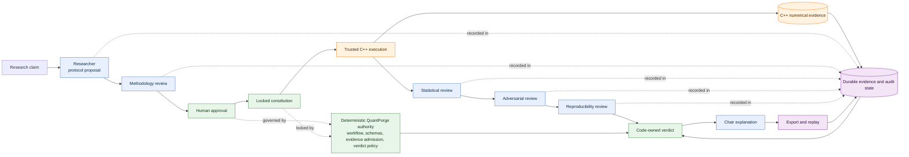

# QuantForge

## A Research Tribunal for Quantitative Claims

**A research tribunal that tests whether quantitative claims deserve trust.**

A persuasive backtest can still be wrong. It may hide selection bias, weak benchmarks, unrealistic
costs, large drawdowns, or evidence that cannot be reconstructed. I built QuantForge to make those
objections part of the experiment instead of leaving them for the end of a research report.

The fastest way to see the project is the offline flagship demonstration. From an installed
development environment with the protected C++ repository beside this one, run:

```bash
./scripts/run_judge_demo.sh ../cpp-event-driven-backtester /private/tmp/quantforge-judge-demo
```

The wrapper checks its dependencies, builds the trusted C++ `v1.0.0` executable outside both source
trees, runs the deterministic mock-provider tribunal, writes machine and human reports, and verifies
the exported evidence. It does not make a network request or modify either source tree.

> **OFFLINE GOVERNED DEMONSTRATION — MOCK PROVIDER**

## What QuantForge is

QuantForge turns a quantitative claim into a governed experiment. A Researcher proposes a protocol,
a Methodology Reviewer challenges it, and a human must approve it before the experiment constitution
is locked. Only then can the trusted C++ engine produce numerical evidence. Statistical,
adversarial, and reproducibility reviews follow. Deterministic code validates the evidence and
computes the strongest permitted verdict; a Chair can explain that verdict but cannot replace it.

This separation is deliberate. Models are useful for proposing methods, looking for weaknesses, and
explaining results. They are not the numerical authority, cannot invent admissible evidence, and do
not choose the verdict.

## Why I built it

Backtests are unusually good at telling convincing stories. A large return is easy to notice, while
the choices behind it—data boundaries, candidate selection, timing assumptions, costs, benchmark
parity, and statistical corrections—are easier to miss. By the time a result reaches a polished
report, those choices can be difficult to reconstruct.

I wanted a research process that could preserve disagreement. QuantForge records the approved
protocol, evidence identities, reviewer objections, state transitions, and verdict inputs as one
replayable case. The goal is not to find more strategies. It is to decide how much trust the current
evidence can support.

## The global problem

The reliability problem is not limited to one asset class or one market. Researchers everywhere
work with noisy data and many plausible choices. Looking at enough strategies, periods, parameters,
or benchmarks can produce an attractive result by chance. If costs, failed trials, contradictory
evidence, or provenance are omitted, a backtest may look much stronger than the underlying evidence.

QuantForge addresses that general research-governance problem with explicit constitutions, narrow
evidence admission, adversarial review, deterministic verdict limits, and reproducible exports. Its
current evidence is synthetic and validates the system boundary, not a profitable trading claim.

## Flagship demonstration

The flagship case begins with a deliberately attractive result from the protected deterministic C++
engine:

- total return: **185.43%**;
- benchmark return: **84.46%**;
- excess return: **100.97%** after declared costs.

That is not the end of the case. The admitted evidence also reports:

- maximum drawdown: **−42.47%**;
- corrected reality-check p-value: **0.308691** against a 0.05 criterion;
- bootstrap probability of loss: **25.2%** against a 10% limit;
- a 95% bootstrap return interval whose lower bound is below zero;
- material concentration and regime objections.

The numerical result is real output from the frozen synthetic fixture, but it is not evidence of
live profitability. The role prose is deterministic fixture output. After replay and independent
reconstruction pass, the code-owned verdict is still **INCONCLUSIVE**. That verdict is meaningful:
the point estimate is attractive, but the claim as written asks for statistical reliability and
robustness that the evidence does not establish.

## Architecture



Blue nodes are model-generated proposals, reviews, or explanations. Green nodes are deterministic
QuantForge authority. Orange nodes are trusted numerical execution and evidence. Purple nodes are
the durable evidence and audit boundary. A screenshot-oriented version is available in the
[submission architecture sheet](submission-materials/ARCHITECTURE.md).

## What the model may and may not do

| The model may | The model may not |
| --- | --- |
| Propose a falsifiable experiment protocol | Approve the experiment for the human |
| Review methodology and identify weaknesses | Change the locked constitution |
| Interpret evidence through role-specific schemas | Execute the numerical engine |
| Raise statistical, adversarial, and reproducibility objections | Create or alter admissible evidence |
| Explain the already computed outcome | Advance workflow state or strengthen the verdict |

Provider outputs pass strict schemas, identity checks, evidence-reference rules, revision checks, and
role-specific validation before code accepts them. The provider has no shell, filesystem, broker,
or market-data tools.

## Run the offline demonstration

### Supported environment

- Linux or macOS;
- Python 3.12 or newer;
- CMake and a C++20 compiler;
- Git;
- the QuantForge development environment or an installed `quantforge` command;
- a clean checkout of the protected C++ repository with the exact `v1.0.0` tag.

Install the reviewed development lock from this repository:

```bash
python3.12 -m venv .venv
.venv/bin/python -m pip install --require-hashes -r requirements-dev.lock
.venv/bin/python -m pip install -e . --no-deps --no-build-isolation
```

Then run the one-command demonstration:

```bash
./scripts/run_judge_demo.sh ../cpp-event-driven-backtester /private/tmp/quantforge-judge-demo
```

The output directory must not already exist and must be outside both repositories. On Linux, `/tmp`
may be used instead of `/private/tmp`. Set `QUANTFORGE_CLI` to an installed executable when you do
not want the wrapper to use `.venv/bin/quantforge`.

For lower-level control, the existing `quantforge demo run` and `quantforge demo verify` commands are
documented in the [governed tribunal runbook](docs/GOVERNED_TRIBUNAL_DEMO.md).

## Verify the evidence and reconstruction

The judge wrapper runs verification automatically. To repeat it independently:

```bash
.venv/bin/quantforge demo verify /private/tmp/quantforge-judge-demo
```

The artifact set contains:

- `case-spec.json` — the claim, assumptions, controls, criteria, and failure gates;
- `tribunal-result.json` — the complete machine-readable case and identities;
- `tribunal-report.md` — the human-readable report;
- `evidence-manifest.json` — key facts and suggested capture order;
- `case-package/` — the reconstructable durable export;
- `demo-manifest.json` — the closed SHA-256 inventory.

Verification rejects missing, extra, substituted, stale, symlinked, or hash-mismatched artifacts. It
then reconstructs the final case, verifies the audit replay, and recomputes the stable demonstration
identity.

## Comparative evaluation

The versioned benchmark contains 24 cases covering research defects, evidence attacks, authority
violations, reproducibility failures, and one sound control. It compares a single-agent baseline, a
planner–reviewer baseline, and the real six-role QuantForge tribunal under the same fixture provider
and budgets.

```bash
.venv/bin/quantforge evaluation compare --subset full \
  --output-dir /private/tmp/quantforge-evaluation
.venv/bin/quantforge evaluation verify-export /private/tmp/quantforge-evaluation
.venv/bin/quantforge evaluation replay /private/tmp/quantforge-evaluation
.venv/bin/quantforge evaluation report /private/tmp/quantforge-evaluation --format human
```

All current results are labeled **OFFLINE DETERMINISTIC EVALUATION — MOCK PROVIDER**. They validate
routing, scoring, schema enforcement, persistence, replay, and authority boundaries. They do not
measure live model intelligence or establish global superiority. See the
[evaluation methodology](docs/EVALUATION_METHODOLOGY.md).

## How Codex and GPT-5.6 were used

I used Codex and GPT-5.6 as engineering collaborators under a student-directed architecture. They
helped turn requirements into bounded implementation slices, draft and review code, generate test
cases, trace trust boundaries, challenge assumptions, investigate failures, and tighten technical
documentation. I made the architecture, scope, governance, release, and merge decisions and reviewed
the resulting code and evidence.

The build sequence was deliberate: first the deterministic C++ engine, then the QuantForge
trust-boundary foundation, the six-role tribunal, the official structured OpenAI provider, the
governed offline demonstration, and finally the comparative benchmark and baselines. Adversarial
remediation, independent audit records, hash-locked dependencies, and protected GitHub workflows
were used to keep AI-assisted development reviewable. Codex and GPT-5.6 were collaborators, not the
project author or an autonomous release authority.

## Repository structure

| Path | Purpose |
| --- | --- |
| `src/quantforge/domain/` | Strict claim, constitution, evidence, review, and verdict models |
| `src/quantforge/roles/` | Six role contracts, request construction, validation, and orchestration |
| `src/quantforge/engine/` | Narrow trusted adapter for the protected C++ `v1.0.0` release |
| `src/quantforge/storage/` | SQLite persistence, export, integrity checks, and reconstruction |
| `src/quantforge/evaluation/` | Versioned 24-case comparative benchmark and baselines |
| `src/quantforge/demo/` | Flagship governed demonstration and artifact verification |
| `docs/` | Architecture, governance, security, provider, evidence, and operator references |
| `audit/` | Independent audit and release-verification records |
| `submission-materials/` | Editable Devpost, architecture, video, verification, and checklist drafts |

## Testing and evidence

Version `0.1.0` remains the current package identity and communicates an audited research-governance
foundation, not a production trading system or an empirical financial result.

The repository gate runs formatting, Ruff, strict mypy, the full branch-aware pytest suite, a 90%
combined governance-critical coverage floor, higher provider/orchestrator floors, malicious-input
regressions, repository and documentation contracts, secret scanning, CFF validation, and source and
wheel inspection:

```bash
scripts/quality.sh
```

The protected C++ `v1.0.0` release is identified by an annotated, protected tag and verified asset
hashes. GitHub's native immutable-release flag for that older release remains false; the release is
not described as GitHub-native immutable. QuantForge `v0.1.0` is GitHub-native immutable. Exact tag,
target, asset, and hash records are in the
[submission verification record](submission-materials/VERIFICATION_RECORD.md).

## Offline mock versus live OpenAI status

The repository contains an official OpenAI provider using strict structured outputs, explicit model
selection, bounded retries, provenance capture, and no tool access. It is disabled by default. The
flagship demonstration and comparative results in this submission use deterministic fixture
providers and make no OpenAI call.

Funded live contract verification is still pending. Comparative live transport is also not enabled
in this phase. Until those steps are separately authorized and recorded, this project makes no claim
about live GPT-5.6 output quality, latency, cost, or reliability. See the
[OpenAI provider runbook](docs/OPENAI_PROVIDER_RUNBOOK.md) and
[future live evaluation runbook](docs/LIVE_EVALUATION_RUNBOOK.md).

## Limitations

- The flagship evidence is deterministic synthetic data, not empirical market evidence.
- The demo role responses are fixtures, not live model responses.
- The project is research governance software, not investment advice or a profitability claim.
- There is no broker connectivity, order submission, live trading, external market-data ingestion,
  retrieval system, web dashboard, or production deployment.
- Audit chains are locally tamper-evident but are not externally signed or timestamped.
- A trusted host and the protected C++ release boundary are still part of the threat model.

More detail is in [Limitations](docs/LIMITATIONS.md), the [Security Model](docs/SECURITY_MODEL.md),
and the [Threat Model](docs/THREAT_MODEL.md).

## Future development

The next bounded steps are funded live OpenAI contract verification, an approved live comparative
evaluation, external reproduction, signed or independently anchored audit evidence, and broader
empirical validation under reviewed data licenses. Those are future research tasks, not completed
submission features.

## Detailed technical documentation

- [Technical architecture](docs/ARCHITECTURE.md)
- [Experiment constitution](docs/EXPERIMENT_CONSTITUTION.md)
- [Governance](docs/GOVERNANCE.md)
- [Evidence model](docs/EVIDENCE_MODEL.md)
- [Verdict policy](docs/VERDICT_POLICY.md)
- [Role contracts](docs/ROLE_CONTRACTS.md)
- [Storage model](docs/STORAGE_MODEL.md)
- [C++ integration contract](docs/ENGINE_INTEGRATION_CONTRACT.md)
- [Deterministic semantics](docs/DETERMINISM.md)
- [Operator runbook](docs/OPERATOR_RUNBOOK.md)
- [Release policy](docs/RELEASE_POLICY.md)
- [Phase 1 independent audit](audit/phase1_independent_audit.md)

QuantForge is licensed under Apache License 2.0. See [LICENSE](LICENSE) and [NOTICE](NOTICE).
