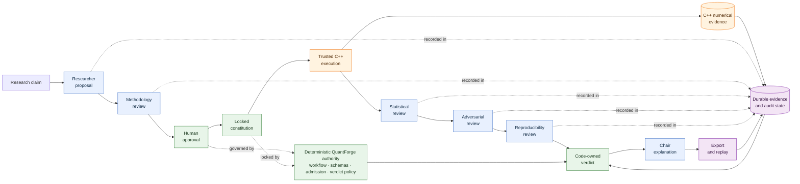

# QuantForge architecture

This is the judge-facing, screenshot-ready view of the governed flagship path.

## Legend

| Colour | Responsibility |
| --- | --- |
| Blue | Model-generated proposal, specialist review, or final explanation |
| Green | Deterministic QuantForge authority, including human approval capture and verdict limits |
| Orange | Trusted C++ numerical execution and admitted numerical evidence |
| Purple | Durable case, evidence, audit, export, and reconstruction state |

The model never crosses into the authority or numerical-evidence boundaries. It cannot approve a
case, change a locked constitution, run the engine, create admissible evidence, advance workflow
state, or strengthen the computed verdict.

## Screenshot guidance

- Use GitHub's light theme at 100% zoom.
- Capture the title, diagram, and legend together if they remain legible.
- If a 16:9 crop is required, capture the diagram first and the legend as a second insert.
- Keep the colour legend visible when this diagram is used without narration.
